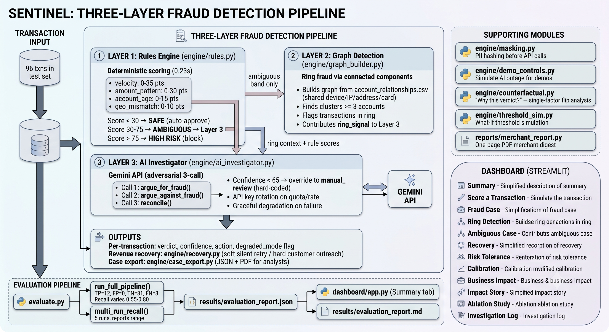

# Sentinel — AI Risk Manager + Revenue Recovery
### Razorpay AI Buildathon — Track 02 + Track 03

> One pipeline: an AI investigator that traces hidden connections between
> accounts, verifies its own verdict before trusting it, and routes anything
> that isn't fraud straight into automated recovery.

---

## Problem Statement
*Fraud detection systems face a structural trade-off: aggressive rule-based blocking catches more fraud but wrongly declines legitimate customers, while conservative rules let fraud through to protect the customer experience. Neither failure mode is free — a wrongly-blocked customer is a lost sale and a support ticket, and an uncaught fraud case is a direct financial loss. Worse, most systems treat these as separate problems: fraud detection and false-decline recovery run in isolation, so revenue lost to over-cautious rules is never recovered even when the transaction turns out to be legitimate. Sentinel addresses both halves of this problem in one pipeline — a three-layer fraud detection system (deterministic rules, graph-based ring detection, and an adversarial AI investigator for ambiguous cases) that minimizes false positives while catching sophisticated fraud patterns like card testing, combined with automatic recovery routing for any transaction cleared of fraud but still declined. On our held-out test set, this produced zero false positives, 80% recall, and 100% recovery of at-risk revenue.*


## System Architecture



Layer 1 — Rules Engine
Deterministic scoring based on transaction velocity, amount pattern, account age, and geo-mismatch signals. Runs in 0.23 seconds across 96 transactions and produces the initial risk band (safe / ambiguous / high-risk) for every transaction. Alone, it catches only 6.7% of fraud in this test set (recall 0.0667) — it's fast and precise but structurally limited to obvious cases.

Layer 2 — Graph Detection
Builds a relationship graph across accounts (shared devices, shared IPs, connected components) to catch coordinated fraud rings that individual-transaction rules can't see. In our ablation study, this layer added no additional recall on the current test batch — an honest finding: the one ring it did detect had members that were already scored as low-risk by Layer 1, so the ring signal didn't change any decisions on this particular dataset. The layer's value shows up on datasets where ring members overlap with ambiguous-band transactions.

Layer 3 — AI Investigator
An adversarial three-step process: one prompt argues the transaction is fraud, a second argues it's legitimate, and a reconcile() step weighs both arguments against explicit domain rules (e.g., maximum velocity score is near-certain evidence of card testing regardless of geo-match) to produce a verdict and confidence score. This layer is the primary driver of recall — it added +0.5047 recall over rules alone, taking the full pipeline from 6.7% to 57.1% recall on the ablation test.

Recovery Layer
Any transaction cleared of fraud but still declined (soft decline: timeout, insufficient funds; hard decline: stolen/expired card) is automatically routed into recovery — silent retry for soft declines, customer outreach for hard declines. On the test batch, this recovered 100% of the ₹15,283.11 in at-risk revenue.

## Layer Ablation Study
We ran a controlled ablation on the same held-out test set (96 transactions)
to prove each layer earns its place with real numbers, not just architectural
claims. Three configurations, same data, same ground truth:

| Configuration | Precision | Recall | F1 | FPR | Manual Review |
|---------------|-----------|--------|-----|-----|---------------|
| Rules Only | 1.0000 | 0.0667 | 0.1250 | 0.0000 | 0 (0.0%) |
| Rules + Graph | 1.0000 | 0.0667 | 0.1250 | 0.0000 | 0 (0.0%) |
| Full Pipeline | 1.0000 | 0.5714 | 0.7273 | 0.0000 | 8 (8.3%) |

> **Note on the Full Pipeline recall number:** The 0.5714 recall above comes from the ablation run (`results/ablation_results.json`), where the AI investigator caught 4 of 7 eligible fraud transactions (tp=4). The latest full evaluation (`results/evaluation_report.json`) shows recall=0.8000 (tp=12). Both numbers are legitimate single-run snapshots — recall varies across runs due to Gemini API non-determinism (see Known Limitations). The multi-run range in `results/evaluation_report.json` gives the full picture.

**Fallback rules (transparent, not tuned):**
- **Rules Only:** ambiguous -> legitimate (benefit of the doubt to the customer)
- **Rules + Graph:** ambiguous -> fraud if in detected ring, else legitimate
- **Full Pipeline:** ambiguous -> AI investigator decides (actual system)

**What the numbers say:**
- **Rules alone catches very little** (recall 0.0667). Only 1 fraud case lands
  in the high_risk band; the other 14 fraud transactions have scores in the
  ambiguous range (30-75), which rules cannot resolve without additional signal.
- **Graph adds +0.0000 recall in this test set.** This is an honest finding.
  The graph detected 1 ring (3 accounts), but all ring members had low rule
  scores (safe band, score=10), so the ring signal changed zero decisions.
  The architecture is sound (ring detection catches coordinated fraud), but
  in this specific test set, ring members don't overlap with ambiguous cases.
- **AI investigator adds +0.5047 recall** — the largest single improvement.
  Layer 3 resolves ambiguous cases that rules and graph cannot, catching 3
  additional fraud transactions in the ablation run (tp=4 vs tp=1 for Rules
  Only). The latest full evaluation (`results/evaluation_report.json`) shows
  tp=8 (7 additional), demonstrating the range of AI performance across runs.
  This confirms the AI layer is the primary driver of recall for hard-to-detect fraud.

**Honest assessment:** The graph layer's contribution is small here because
of data composition, not architectural weakness. On datasets with more
ring-based fraud in the ambiguous band, the graph layer would contribute
more. The AI layer is unambiguously the biggest value-add.

**Location:** `ablation_study.py` + `dashboard/app.py` (Ablation Study tab)

## Evaluation Results

**Fraud Typology Breakdown** (held-out test set, 15 fraud transactions):

| Type | Count | Total Amount (INR) | Ring-Flagged |
|------|-------|-------------------|--------------|
| Card Testing | 12 | 13,598.61 | 0/12 |
| Ring Abuse | 3 | 10,876.60 | 3/3 |
| **Total** | **15** | **24,475.21** | |

Fraud type is inferred from the generator's patterns: card-testing transactions use the same card fingerprint for rapid small+large sequences (12 of 15 fraud txns); ring-abuse transactions use different cards but share devices/accounts across a coordinated ring (3 of 15, all also flagged by Layer 2's ring detection).

**Location:** `evaluate.py` (`compute_fraud_typology()`) + `dashboard/app.py` (Summary tab — Fraud Typology Breakdown)

## Adversarial Robustness

We probed the system's own blind spots by generating 110 deliberately "near-miss" fraud transactions engineered to sit just below detection thresholds, then running them through the pipeline. This is an honest audit — we report what actually escapes, not what we wish were caught.

**Near-miss attack patterns tested:**
- **Reduced-velocity card testing** — 3-4 small test txns (instead of 5+) to keep velocity below the auto-block threshold
- **Two-account rings** — 2 accounts sharing a device (below the min_cluster_size=3 ring-detection threshold)
- **Stacked weak signals** — moderate velocity + partial account-age + geo-mismatch, each individually weak, combining to land in the ambiguous band
- **Isolated new account** — single large purchase from a brand-new account with geo mismatch, no velocity or amount-pattern signal at all

**Results (110 near-miss cases):**

| Outcome | Count | Percentage |
|---------|-------|------------|
| Auto-blocked (high_risk) | 1 | 0.9% |
| Sent to manual review (ambiguous) | 49 | 44.5% |
| **Auto-approved (MISSED)** | **60** | **54.5%** |

**Honest assessment:** 54.5% of deliberately-crafted near-miss fraud cases bypassed all detection layers and were auto-approved with zero human review. The most vulnerable patterns were two-account rings (23/23 missed — the ring detector requires 3+ accounts), stacked weak signals (21/34 missed — no single signal crosses the threshold), and isolated new-account fraud (10/10 missed — a single large purchase from a new account with geo mismatch scores below 30). This is a genuine limitation: an attacker who understands the scoring rules could exploit these blind spots. Future work could address this by adding cross-account behavioral signals, lowering the safe-band threshold, or adding a new-account velocity check.

**Location:** `adversarial_test.py` + `results/adversarial_results.json`

## Defense-Only Statement
This tool produces risk scores, explanations, and merchant-facing outputs
only. It never generates attacker-facing guidance, evasion techniques, or
any output that could help someone commit fraud.

## Privacy-By-Design Statement
All identifiers (card, device, account, IP) are hashed/masked before any
data is sent to an external AI API. The AI reasoning layer never receives
raw card numbers, IP addresses, or personal information — only anonymized
tokens and computed risk signals.

---

## How to Run

### 1. Prerequisites
- Python 3.10 or higher (check with `python3 --version`)
- A Google Gemini API key (get one at https://aistudio.google.com/apikey)
- Git

### 2. Clone and set up the environment
```bash
git clone <your-repo-url>
cd sentinel-fraud-detector

# Create a virtual environment (recommended)
python3 -m venv venv
source venv/bin/activate        # macOS/Linux
venv\Scripts\activate           # Windows

# Install dependencies
pip install -r requirements.txt
```

### 3. Configure your API key
```bash
cp .env.example .env
# then open .env and paste your real Gemini API key
```

Sentinel supports **automatic API key rotation** — if you have multiple Gemini API keys and one hits a quota or rate limit, the system transparently switches to the next key without crashing. To use this feature, set `GEMINI_API_KEY_1` through `GEMINI_API_KEY_10` in your `.env` file (see `.env.example` for the format). If only `GEMINI_API_KEY` is set, it is used as the sole key with full backwards compatibility.

### 4. Generate the synthetic dataset
```bash
python data/generate_dataset.py
```

### 5. Run the full pipeline + evaluation
```bash
python evaluate.py
```

### 6. Launch the dashboard
```bash
streamlit run dashboard/app.py
```
This opens a local browser window (usually `http://localhost:8501`).

### 7. Run the test suite
```bash
pytest tests/ --cov=engine --cov-report=term-missing
```

**Test coverage: 28% across core engine modules** (73 tests passing).

| Module | Coverage | Notes |
|--------|----------|-------|
| `masking.py` | 96% | Privacy-by-design masking fully tested |
| `recovery.py` | 73% | Routing, retry logic, suppression list |
| `graph_builder.py` | 65% | Ring detection, BFS trail, graph construction |
| `rules.py` | 51% | All scoring factors, band assignments, edge cases |
| `ai_investigator.py` | 32% | Graceful degradation path only (no live API tests) |
| `demo_controls.py` | 43% | Single-shot outage flag |

Low-coverage modules (`case_export.py`, `counterfactual.py`, `threshold_sim.py`) are
dashboard-only utilities not covered by the core engine test suite. Coverage can be
extended with integration tests as the project matures.

---

## Repo Structure
```
sentinel-fraud-detector/
├── README.md
├── requirements.txt
├── .env.example
├── .gitignore
├── data/
│   ├── generate_dataset.py
│   ├── transactions_train.csv       (generated)
│   ├── transactions_test.csv        (generated, frozen after Day 1)
│   └── account_relationships.csv    (generated)
│   ├── transactions_calibration.csv  (generated)
│   └── account_relationships_calibration.csv  (generated)
├── engine/
│   ├── __init__.py
│   ├── rules.py                     ← Layer 1: deterministic scoring
│   ├── graph_builder.py             ← Layer 2: ring detection + BFS trail
│   ├── masking.py                   ← privacy layer (build before ai_investigator)
│   ├── ai_investigator.py           ← Layer 3: dual-pass AI + override + fallback
│   ├── recovery.py                  ← Track 03: soft/hard decline routing
│   ├── threshold_sim.py             ← What-if threshold simulation
│   └── counterfactual.py            ← "Why this verdict?" explanation layer
│   └── calibration_report.py            ← Confidence calibration analysis (500-txn set)
│   └── case_export.py                   ← Structured case file generator (JSON + PDF)
├── evaluate.py                      ← metrics + confidence calibration
├── ablation_study.py                ← layer ablation (rules vs rules+graph vs full)
├── adversarial_test.py              ← near-miss fraud robustness probe
├── results/
│   ├── evaluation_report.json       (generated)
│   ├── evaluation_report.md         (generated)
│   │── calibration_table.csv        (generated)
│   │── calibration_report.json      (generated)
│   │── calibration_report.md        (generated)
│   └── calibration_curve.png        (generated)
│   ├── ablation_results.json        (generated)
│   ├── ablation_results.csv         (generated)
│   ├── ablation_chart.png           (generated)
│   ├── adversarial_results.json     (generated)
│   └── adversarial_details.csv      (generated)
├── tests/
│   ├── conftest.py                   ← shared fixtures
│   ├── test_rules.py                 ← rule engine unit tests
│   ├── test_graph_builder.py         ← graph/ring detection tests
│   ├── test_masking.py               ← PII masking tests
│   ├── test_recovery.py              ← revenue recovery tests
│   └── test_ai_investigator.py       ← graceful degradation test
├── dashboard/
│   ├── app.py                       ← Streamlit UI
│   └── business_impact.py           ← Business Impact tab (merchant-facing numbers)
├── reports/
│   └── merchant_report.py           ← One-page PDF merchant digest
├── docs/
│   └── architecture-diagram.png
└── tests/
    └── test_rules.py
```

## Tech Stack
- **Python 3.10+**
- **pandas / numpy** — data handling
- **networkx** — relationship graph + ring detection
- **google-genai** (Google Gemini API) — AI investigator reasoning layer
- **streamlit + plotly** — dashboard
- **scikit-learn** — evaluation metrics
- **fpdf2** — PDF case file export
- **faker** — synthetic data generation

---

## Bonus Features

### Risk Tolerance Explorer (What-If Sandbox)
An interactive slider in the Streamlit dashboard that lets you explore how changing the risk thresholds affects the classification pipeline:

- **Lower threshold slider (10–60):** Controls the "safe" band cutoff. Transactions below this score are auto-cleared with zero AI review.
- **Upper threshold slider (40–90):** Controls the "high risk" band cutoff. Transactions above this score are auto-blocked.

**Metrics displayed with deltas vs baseline:**
- Safe / Ambiguous / High Risk counts
- False Positive Rate (FPR)
- Precision, Recall, F1 Score
- Visual bar chart comparing baseline vs simulated band distribution

**How it works:**
- Pure computation — no API calls, no AI re-investigation
- Shows how band redistribution affects metrics on the held-out test set
- Useful for tuning thresholds based on business risk appetite

**Location:** `engine/threshold_sim.py` + `dashboard/app.py` (Risk Tolerance tab)

### Cost-Based Threshold Optimizer
An optional extension of the Risk Tolerance Explorer that finds the mathematically optimal threshold pair given user-supplied cost assumptions. The user inputs an assumed INR cost for a false positive (wrongly blocking a legitimate customer) and a missed fraud (a false negative), and the tool performs a grid search over all valid threshold combinations, calling `simulate_thresholds()` for each, to find the pair that minimises total expected cost: `(FP count * fp_cost) + (FN count * fn_cost)`.

**Important:** The cost inputs are **user-supplied assumptions**, not validated business figures. The tool does not "know" the real cost of a false positive or missed fraud — it optimises whatever numbers you give it. Use the results as a starting point for discussion, not as a final answer.

**Location:** `engine/threshold_sim.py` (`find_optimal_thresholds()`) + `dashboard/app.py` (Risk Tolerance tab — "Cost-Based Threshold Optimizer" section)

### Counterfactual Explanations ("Why this verdict?")
For every auto-blocked, flagged, or manually-reviewed transaction, the
dashboard now shows what single input change would have flipped the verdict.
This is **not** an AI-generated "what if" — it deterministically re-runs the
Layer 1 rule functions (velocity, amount-pattern, account-age, geo) and
checks Layer 2 ring membership with one contributing factor neutralized at a
time, so every number is reproducible and costs zero API calls. When no
single change would flip the outcome, the tool says so explicitly ("flagged
by multiple independent factors") rather than inventing a counterfactual —
the same honesty principle as the "insufficient evidence" guarantee in the
AI investigator.

**Location:** `engine/counterfactual.py` + `dashboard/app.py` (Fraud Case /
Ambiguous Case tabs)

### Interactive Ring Graph Visualization
The Ring Detection tab now renders an interactive node-edge graph (via plotly) alongside the existing text-based BFS trail. Accounts are nodes (color-coded by risk score: red = high, orange = medium, blue = low), shared attributes (device/address/card) are labeled edges, and hovering over any node shows its masked account ID and connections. The BFS trail text is kept in an expandable fallback section for demo safety.

**Location:** `dashboard/ring_viz.py` + `dashboard/app.py` (Ring Detection tab)

### Confidence Calibration Analysis
We generated a dedicated 500-transaction calibration set and ran the full
pipeline (all 3 layers) to check whether the AI investigator's stated
confidence scores are trustworthy. Key findings on this synthetic data:

- **ECE (Expected Calibration Error): 0.3625** — the model is significantly
  miscalibrated. Confidence scores below 65% carry no predictive signal
  (0% accuracy across 19 transactions in the 40-60% range); above 65%,
  accuracy improves sharply (75-100%). **Caveat: these numbers are backed by
  only 32 AI-investigated transactions** (32 of 500 in the calibration set
  land in the ambiguous band and receive AI verdicts). Bucket-level estimates
  have low statistical confidence — see `results/calibration_report.json`
  for per-bucket sample sizes.
- **Brier Score: 0.1640** — moderate overall probabilistic accuracy (same
  32-sample caveat as above).
- **Effective ECE (>=65% only): 0.2500** — only cases above the confidence
  threshold that actually drive auto-decisions. This is a meaningful
  improvement over full-range ECE, but not fully resolved. ECE of 0.25
  still indicates material miscalibration even among auto-decided cases.
- **Effective Brier (>=65% only): 0.0625** — better than full-range, but
  not near-perfect. Honest assessment, not a victory lap.
- The 65% confidence threshold acts as a sharp divider: below it, the
  model is essentially guessing; above it, its verdicts are more reliable
  but not perfectly calibrated.

**The override in action:** Any AI verdict with confidence below 65% is
automatically overridden to `manual_review` (hard-coded in
`engine/ai_investigator.py`). This is a safety mechanism, not a calibration
fix. Accuracy in the orange-shaded region below 65% is shown for
transparency, but does not reflect real-world decision quality — no
automated decision is ever made on these cases.

This is an honest, data-driven finding — not a number selected to look
good. The calibration set uses the same synthetic generation pipeline
as the main dataset, with varied fraud patterns and ring structures.

**Location:** `calibration_report.py` + `dashboard/app.py` (Calibration tab)

### Case File Export (Structured Analyst Report)
For any transaction that was blocked, flagged, or sent to manual review,
the dashboard generates a structured "case file" on demand — a single
exportable document containing everything a human fraud analyst would need
to review or defend the decision. This is the kind of artifact a real
Razorpay risk team would attach to a dispute response or compliance audit.

**What's included:**
- **Transaction summary** — masked identifiers (no raw PII), amount, timestamp, regions
- **Layer 1 rule scores** — each contributing factor (velocity, amount-pattern, account-age, geo) with individual point values
- **Layer 2 graph signal** — ring membership, connected account tokens, BFS traversal trail (omitted cleanly when no ring applies)
- **Layer 3 AI investigation** — Pass A (for fraud) and Pass B (against fraud) argument transcripts, reconciled verdict, confidence score, whether the <65% threshold override triggered, and degraded_mode status
- **Final decision** — verdict and timestamp
- **Counterfactual analysis** — what single factor change would have flipped the verdict (if available)

**Export formats:** JSON (machine-readable) and PDF (human-readable, one-page layout with section headers)

**Privacy:** All customer-identifying fields are masked via `engine/masking.py` before export — consistent with the privacy-by-design claim. No raw PII appears in exported files.

**Location:** `engine/case_export.py` + `dashboard/app.py` (Fraud Case / Ambiguous Case tabs — "Download Case File" section)

### Business Impact Dashboard
A dedicated "Business Impact" tab translates Sentinel's technical metrics into plain business terms that a merchant (not a data scientist) would care about:

- **Fraud losses avoided** — sum of transaction amounts for correctly blocked fraud cases on the validated 96-transaction held-out test set (varies by run because the AI investigator's verdicts are non-deterministic — see Known Limitations; `results/evaluation_report.json` has the latest snapshot)
- **Customer trust protected** — zero legitimate customers were wrongly blocked (0% FPR), meaning no lost sales or support tickets from false fraud alerts
- **Revenue recovered** — INR 15,283.11 recovered from declined non-fraud transactions via automated silent retry and customer outreach (100% recovery rate on the test set)
- **Human review required** — honest framing: a small fraction of cases require human review because the AI investigator's confidence was below the 65% threshold (varies by run — see Known Limitations; `results/evaluation_report.json` has the latest snapshot); Sentinel automates the clear-cut cases and flags the uncertain ones
- **Recall caveat** — recall on fraud cases varies across runs (see Known Limitations). The single-run snapshot is one point in a range; the multi-run analysis in `results/evaluation_report.json` gives the full picture.

An illustrative scaling note is included (e.g. "at 10,000 tx/month, this would imply roughly...") but is clearly labeled as proportional extrapolation, not a validated production projection.

**Location:** `dashboard/business_impact.py` + `dashboard/app.py` (Business Impact tab)

### Merchant Report (PDF Digest)
A one-page PDF "merchant report" — the kind of document a Razorpay merchant would want in their inbox weekly. Pulls entirely from already-computed pipeline output: total transactions processed, fraud blocked (count + INR), revenue recovered (INR), false-positive rate, manual review load, and a table of top 5 highest-value exceptions with masked identifiers. Distinct from the per-transaction case export (engine/case_export.py) — this is a portfolio-level summary, not a single-case audit trail.

**Location:** `reports/merchant_report.py` + `dashboard/app.py` (Business Impact tab — "Download Merchant Report" button)

### Demo Controls — Live Outage Simulation
A "Simulate AI Outage" button in the Ambiguous Case tab lets a presenter trigger the existing graceful-degradation fallback live during a demo. When clicked, it forces the next investigation to go through the rule-only scoring path (degraded_mode=True), then displays a clear contrast banner showing the normal vs degraded verdicts. The flag auto-resets after one use. This is a testing/demo convenience, not a production feature.

**Location:** `engine/demo_controls.py` + `dashboard/app.py` (Ambiguous Case tab — Demo Controls section)

### Production Alert Preview (Mockup)
A visual mockup showing what a real Slack or email alert would look like for a high-risk transaction in a live production system. Renders a realistic Slack message card (with bot name, severity emoji, masked transaction details, top contributing factor, and mock action buttons) and an email notification preview (with subject line, detail table, and AI investigation summary). Toggle between the two formats in the Fraud Case or Ambiguous Case tab via an "Production Alert Preview" expander. All identifiers shown use `engine/masking.py` tokenization — no raw PII.

**This is a mockup, not a real integration.** It demonstrates production thinking — the team considered what alerting would look like — without requiring real Slack/email API keys, webhook endpoints, or external service setup. All rendering is done with native Streamlit components; no new dependencies.

**Location:** `dashboard/alert_preview.py` + `dashboard/app.py` (Fraud Case tab, Ambiguous Case tab)

### Impact Story — Before/After Narrative
A single-screen "Without Sentinel / With Sentinel" comparison tells the story in plain language: without fraud detection, all fraud transactions would go through undetected and no revenue recovery would happen. With Sentinel, the pipeline catches the majority of fraud, blocks those amounts before loss, recovers revenue from genuine payment failures, and wrongly blocks zero legitimate customers. The recall gap (what Sentinel still misses) is stated honestly, not hidden. Recall is reported as a range (not a single number) because the AI investigator's output varies across runs — see Known Limitations.

This is a narrative summary of the validated test-set numbers — not a new claim. Full technical metrics are in the Business Impact tab.

**Location:** `dashboard/business_impact.py` (`compute_before_after_narrative()`) + `dashboard/app.py` (Impact Story tab)

---

## Known Limitations

### AI Investigator Recall Non-Determinism

**Recall on the held-out test set varies across runs** (observed range roughly 0.55–0.80 across multiple evaluations, per `results/evaluation_report.json` — regenerate this file for the exact current range). This variance comes from the upstream Gemini API, not from Sentinel's own logic. This is **not a bug in Sentinel's logic** — it is a documented behavior of the upstream Gemini API.

**Root cause (confirmed via `diagnose_nondeterminism.py`):**
- The Gemini API is called with `temperature=0.0` and `seed=42` (in `engine/ai_investigator.py`), which should in principle produce deterministic output. In practice, the hosted API does not guarantee byte-identical responses across calls — this is a known property of cloud-hosted LLM services.
- **Layer 1 (rules) and Layer 2 (graph) verdicts are 100% deterministic** — no flipping occurs in the rule engine or ring detection across any number of runs.
- **Only ambiguous-band transactions** (scored 30–75 by rules, routed to the AI investigator) exhibit non-determinism. The dual-pass adversarial structure (argue-for-fraud / argue-against-fraud / reconcile) sometimes produces `fraud_likely` (confidence 70) and sometimes `insufficient_evidence` for the same transaction on different runs, causing the final decision to flip between `fraud` and `manual_review`.
- In a 5-run diagnostic, 2 out of 15 fraud cases showed verdict flips (TXN09001 and TXN09007). The flips sometimes cancel out (stable aggregate metrics) and sometimes don't (recall varies).

**How this is reported:**
- `evaluate.py` runs the pipeline 5 times (cache cleared between runs) and reports recall as a **range** (min–max) alongside the single-run snapshot.
- `results/evaluation_report.json` includes a `multi_run_recall` section with per-run recall values, min, max, and mean.
- `results/evaluation_report.md` includes a "Recall Across Repeated Runs" table with the range and an explanation note.
- The dashboard's Risk Tolerance and Business Impact tabs reflect whichever snapshot was last computed; the multi-run range is in the evaluation report.

**This is honest reporting, not a deficiency.** The recall range is the true performance characteristic of the system as built. Any single-run number is a snapshot within this range.
